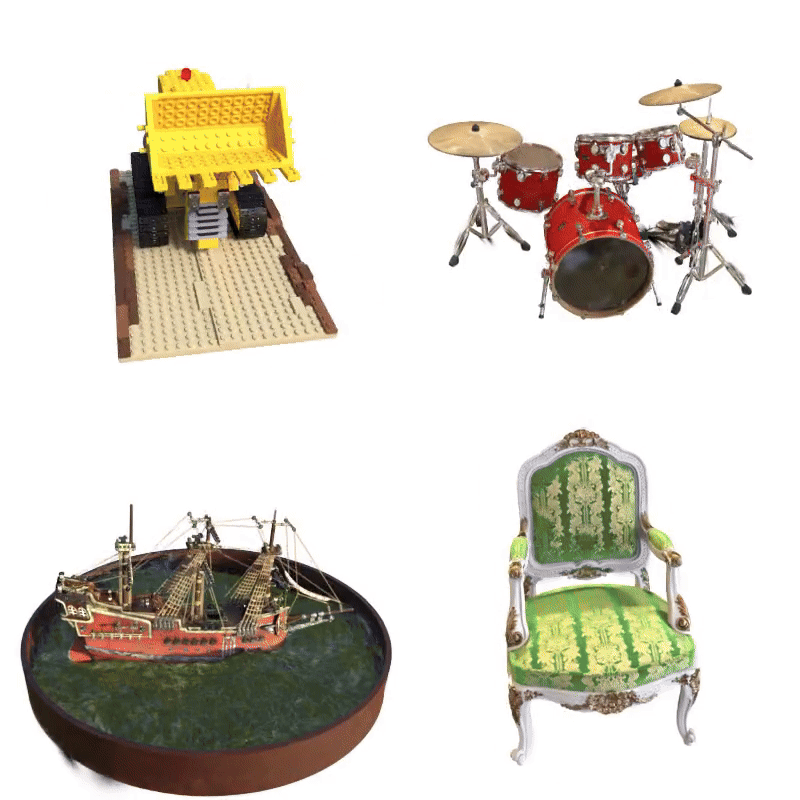

<div align=center>
  <h1>
    Gaussian Splatting: Point-Based Radiance Fields
  </h1>
  <p>
    <a href=https://mhsung.github.io/kaist-cs479-spring-2025/ target="_blank"><b>KAIST CS479: Machine Learning for 3D Data (Spring 2025)</b></a><br>
    Programming Assignment 4
  </p>
</div>

<div align=center>
  <p>
    Instructor: <a href=https://mhsung.github.io target="_blank"><b>Minhyuk Sung</b></a> (mhsung [at] kaist.ac.kr)<br>
    TA: <a href=https://dvelopery0115.github.io target="_blank"><b>Seungwoo Yoo</b></a>  (dreamy1534 [at] kaist.ac.kr)      
  </p>
</div>

<div align=center>
  
</div>

#### Due: TBD, 23:59 KST
#### Where to Submit: KLMS

## Abstract

Following the success of [Neural Radiance Fields (NeRF)](https://arxiv.org/abs/2003.08934) in novel view synthesis using implicit representations, researchers have actively explored adapting similar concepts to other 3D graphics primitives.
The most successful among them is [Gaussian Splatting (GS)](https://repo-sam.inria.fr/fungraph/3d-gaussian-splatting/), a method based on a point-cloud-like representation known as Gaussian Splats.

Unlike simple 3D points that encode only position, Gaussian Splats store local volumetric information by associating each point with a covariance matrix, modeling a Gaussian distribution in 3D space.
These splats can be efficiently rendered by projecting and rasterizing them onto an image plane, enabling real-time applications as demonstrated in the paper.

In this assignment, we will explore the core principles of the Gaussian Splat rendering algorithm by implementing its key components.
As in our previous assignment on NeRF, we strongly encourage you to review the paper beforehand or while working on this assignment.

<details>
<summary><b>Table of Content</b></summary>
  
- [Abstract](#abstract)
- [Setup](#setup)
- [Code Structure](#code-structure)
- [Tasks](#tasks)
  - [Task 0. Download Data](#task-0-download-data)
  - [Task 1.]()
  - [Task 4. Qualitative \& Quantitative Evaluation](#task-4-qualitative--quantitative-evaluation)
- [What to Submit](#what-to-submit)
- [Grading](#grading)
- [Further Readings](#further-readings)
</details>

## Setup

To get started, clone this repository first.
```
git clone --recursive {PROJECT_URL}
```

We recommend creating a virtual environment using `conda`.
To create a `conda` environment, issue the following command:
```
conda create --name cs479-gs python=3.10
```
This should create a basic environment with Python 3.10 installed.
Next, activate the environment and install the dependencies using `pip`:
```
conda activate cs479-gs
```
The remaining dependencies are the ones related to PyTorch and they can be installed with the command:
```
pip install torch==2.5.1 torchvision==0.20.1 torchaudio==2.5.1 --index-url https://download.pytorch.org/whl/cu124
pip install torchmetrics[image]
pip install imageio[ffmpeg]
pip install plyfile tyro jaxtyping typeguard
pip install simple-knn/.
```

Register the project root directory (i.e., `gs_renderer`) as an environment variable to help the Python interpreter search our files.
```
export PYTHONPATH=.
```

By default, the configuration is set to render `lego` scene. You can select different scenes by altering argument `Args` in `render.py`. Run the following command to render the scene:
```
python render.py
```
For now, running this command will result in an error, as the Gaussian Splat files have not been downloaded yet.  

All by-products made during rendering, including images, videos, and evaluation results, will be saved in an experiment directory under `outputs/{SCENE NAME}`.


## Code Structure
This codebase is organized as the following directory tree. We only list the core components for brevity:
```
gs_renderer
│
├── data                <- Directory for data files.
├── src
│   ├── camera.py       <- A light-weight data class for storing camera parameters.
│   ├── renderer.py     <- Main renderer implementation.
│   ├── scene.py        <- A light-weight data class for storing Gaussian Splat parameters.
│   └── sh.py           <- A utility for processing Spherical Harmonic coefficients.
├── render.py           <- Main script for rendering.
└── README.md           <- This file.
```

## Tasks

### Task 0. Download Data

Download the scene files (`data.zip`) from [here](https://drive.google.com/file/d/16z6kmnPgvPN-HVu0TpCloxvygUrjCzu6/view?usp=sharing) and extract them into the root directory.
After extraction, the `data` directory should be structured as follows:
```
data
│
├── cam_data.npz        <- Camera parameters.
├── chair.ply           <- "Chair" Scene.
├── drums.ply           <- "Drums" Scene.
├── ficus.ply           <- "Ficus" Scene.
├── hotdog.ply          <- "Hotdog" Scene.
├── lego.ply            <- "Lego" Scene.
├── materials.ply       <- "Materials" Scene.
├── mic.ply             <- "Mic" Scene.
└── ship.ply            <- "Ship" Scene.
```

### Task 1.

### Task 4. Qualitative \& Quantitative Evaluation

For qualitative evaluation, render the trained scene with the provided script. 
```
python torch_nerf/runners/render.py +log_dir=${LOG_DIR} +render_test_views=False
```
This will produce a set of images rendered while orbiting around the upper hemisphere of an object.
The rendered images can be compiled into a video using the script `scripts/utils/create_video.py`:
```
python scripts/utils/create_video.py --img_dir ${RENDERED_IMG_DIR} --vid_title ${VIDEO_TITLE}
```

For quantitative evaluation, render the trained scene again, **but from the test views**.
```
python torch_nerf/runners/render.py +log_dir=${LOG_DIR} +render_test_views=True
```
This will produce 200 images (in the case of the synthetic dataset) held out during training.
After rendering images from the test view, use the script `evaluate.py` to compute LPIPS, PSNR, and SSIM. For instance, to evaluate the implementation for the `lego` scene:
```
python torch_nerf/runners/evaluate.py ${RENDERED_IMG_DIR} ./data/nerf_synthetic/lego/test
```
The metrics measured after training the network for 50k iterations on the `lego` scene are summarized in the following table.
| LPIPS (↓) | PSNR (↑) | SSIM (↑) |
|---|---|---|
| 0.0481 | 28.9258 | 0.9473 |

> :bulb: **For details on grading, refer to section [Evaluation Criteria](#evaluation-criteria).**

## What to Submit

Compile the following files as a **ZIP** file named `{NAME}_{STUDENT_ID}.zip` and submit the file via Gradescope.
  
- The folder `torch_nerf` that contains every source code file;
- A folder named `{NAME}_{STUDENT_ID}_renderings` containing the renderings (`.png` files) from the **test views** used for computing evaluation metrics;
- A text file named `{NAME}_{STUDENT_ID}.txt` containing **a comma-separated list of LPIPS, PSNR, and SSIM** from quantitative evaluation;
- The checkpoint file named `{NAME}_{STUDENT_ID}.pth` used to produce the above metrics.

## Grading

**You will receive a zero score if:**
- **you do not submit,**
- **your code is not executable in the Python environment we provided, or**
- **you modify any code outside of the section marked with `TODO`.**
  
**Plagiarism in any form will also result in a zero score and will be reported to the university.**

**Your score will incur a 10% deduction for each missing item in the [Submission Guidelines](#submission-guidelines) section.**

Otherwise, you will receive up to 300 points from this assignment that count toward your final grade.

| Evaluation Criterion | LPIPS (↓) | PSNR (↑) | SSIM (↑) |
|---|---|---|---|
| **Success Condition \(100%\)** | **0.06** | **28.00** | **0.90** |
| **Success Condition \(50%)**   | **0.10**  | **20.00** | **0.60** |

As shown in the table above, each evaluation metric is assigned up to 100 points. In particular,
- **LPIPS**
  - You will receive 100 points if the reported value is equal to or, *smaller* than the success condition \(100%)\;
  - Otherwise, you will receive 50 points if the reported value is equal to or, *smaller* than the success condition \(50%)\.
- **PSNR**
  - You will receive 100 points if the reported value is equal to or, *greater* than the success condition \(100%)\;
  - Otherwise, you will receive 50 points if the reported value is equal to or, *greater* than the success condition \(50%)\.
- **SSIM**
  - You will receive 100 points if the reported value is equal to or, *greater* than the success condition \(100%)\;
  - Otherwise, you will receive 50 points if the reported value is equal to or, *greater* than the success condition \(50%)\.

## Further Readings

If you are interested in this topic, we encourage you to check out the papers listed below.

- [NeRF++: Analyzing and Improving Neural Radiance Fields (arXiv 2021)](https://arxiv.org/abs/2010.07492)
- [NeRF in the Wild: Neural Radiance Fields for Unconstrained Photo Collections (CVPR 2021)](https://arxiv.org/abs/2008.02268)
- [pixelNeRF: Neural Radiance Fields from One or Few Images (CVPR 2021)](https://arxiv.org/abs/2012.02190)
- [Mip-NeRF: A Multiscale Representation for Anti-Aliasing Neural Radiance Fields (ICCV 2021)](https://arxiv.org/abs/2103.13415)
- [BARF: Bundle-Adjusting Neural Radiance Fields (ICCV 2021)](https://arxiv.org/abs/2104.06405)
- [Nerfies: Deformable Neural Radiance Fields (ICCV 2021)](https://arxiv.org/abs/2011.12948)
- [NeuS: Learning Neural Implicit Surfaces by Volume Rendering for Multi-view Reconstruction (NeurIPS 2021)](https://arxiv.org/abs/2106.10689)
- [Volume Rendering of Neural Implicit Surfaces (NeurIPS 2021)](https://arxiv.org/abs/2106.12052)
- [Mip-NeRF 360: Unbounded Anti-Aliased Neural Radiance Fields (CVPR 2022)](https://arxiv.org/abs/2111.12077)
- [RegNeRF: Regularizing Neural Radiance Fields for View Synthesis from Sparse Inputs (CVPR 2022)](https://arxiv.org/abs/2112.00724)
- [Mega-NeRF: Scalable Construction of Large-Scale NeRFs for Virtual Fly-Throughs (CVPR 2022)](https://arxiv.org/abs/2112.10703)
- [Plenoxels: Radiance Fields without Neural Networks (CVPR 2022)](https://arxiv.org/abs/2112.05131)
- [Point-NeRF: Point-based Neural Radiance Fields (CVPR 2022)](https://arxiv.org/abs/2201.08845)
- [Instant-NGP: Instant Neural Graphics Primitives with a Multiresolution Hash Encoding (SIGGRAPH 2022)](https://arxiv.org/abs/2201.05989)
- [TensoRF: Tensorial Radiance Fields (ECCV 2022)](https://arxiv.org/abs/2203.09517)
- [MobileNeRF: Exploiting the Polygon Rasterization Pipeline for Efficient Neural Field Rendering on Mobile Architectures (CVPR 2023)](https://arxiv.org/abs/2208.00277v5)
- [Zip-NeRF: Anti-Aliased Grid-Based Neural Radiance Fields (ICCV 2023)](https://arxiv.org/abs/2304.06706)
